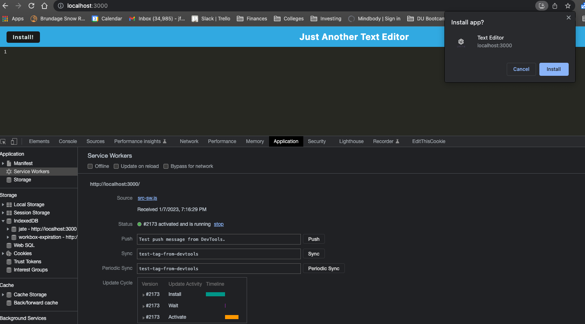

## (PWA) Progressive Web Applications : Text Editor

## Description

This is an installable PWA web code editor that enables note or code snippet creation with or without an internet connection. The notes are stored in local storage and the indexDB for offline persistance. The integrated service worker and Cache API's enables offline mode.

The URL of the GitHub repository is https://github.com/jfulbright/PWA-Text-Editor.

🚀 The application has been deployed to Heroku and the URL of the deployed application is:-
 
https://sleepy-retreat-79725.herokuapp.com/

## Table of Contents

* [Installation](#installation)
* [Usage](#usage)
* [References](#references)
* [License](#license)

## Installation

* This application will require the installation of Node.js and various npm packages.

*   Node Package Manager (npm) is a software manager and installer which puts the modules in place so that the node project can utilize it, and also, it manages dependency conflicts intelligently and initialized using **npm init**. The package.json will be generated and will contains all the details of the application in which the user have inputted during the npm initialization. 

*  This application will use the following npm packages:-

         * npm install express (express.js)
         * npm install --save-dev webpack (Webpack)
         * npm install webpack-dev-server --save-dev (webpack-dev-server)
         * npm install --save-dev webpack-pwa-manifest (WebpackPwaManifest)
         * npm install babel (Babel)
         * npm install --save-dev css-loader (CSS-loader)
         * npm install concurrently --save (run multiple commands concurrently.) (Concurrently)
         * npm npm install idb (IndexedDB)

* The required modules are bundled in the package.json file and at CLI or integrated terminal type in **npm run install**, the modules will be installed.       

## Usage:
* Uses IndexedDB to create an object store and includes both GET and PUT methods
* The application works without an internet connection
* Automatically saves content inside the text editor when the DOM window is unfocused
* Bundled with webpack
* Creates a service worker with workbox that Caches static assets
* Use babel to use async / await
* Generates manifest.json using the WebpackPwaManifest plug-in
* Can be installed as a Progressive Web Application

## Screenshots

1. **Installed PWA App:** 
PWA Application can be installed locally

    *Below is the screenshot of the text editor running as a  locally installed Chrome App*

    

    *Below is the screenshot of the Chrome App prompt and manifest*

    

     *Below is the  screenshot of the app in the Chrome browser"*

    

1. **Offline Mode:** Text content is stored locally in IndexedDB database and Local Storage

    *Below is the  screenshot of content in the text editor stored and has been retrieved from the IndexedDB"*

    

## Technology
_________________
* HTML
* CSS
* Javascript
* NodeJS
* ExpressJS
* idb package for IndexedDB API
* Deployed to Heroku
* Babel
* WebpackPwaManifest
* codemirror text editor

## Questions
  _________________
  Contact me with any questions, comments or suggestions at:
* [GitHub.com/jfulbright](http://github.com/jfulbright)
* [jfulbright](mailto:jfulbright)
* [LinkedIn.com/in/JeremyFulbright](https://www.linkedin.com/in/JeremyFulbright)

## License

This project is licensed under the terms of the MIT license.